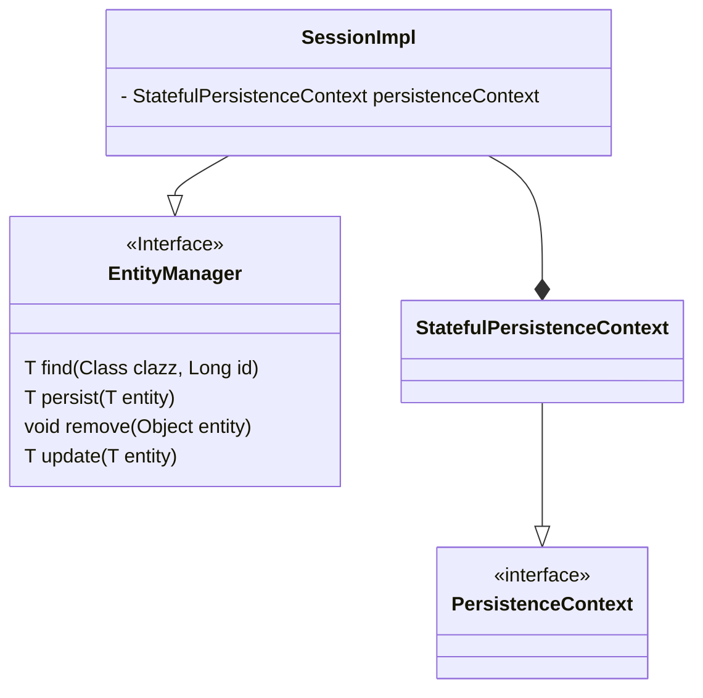
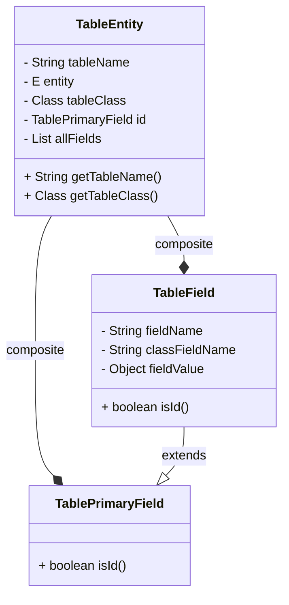

## 요구 사항 1 - Persistence Context 구현

```Java
public interface EntityManager {
    
}

public interface PersistenceContext {
    // 객체를 어떻게 관리할 수 있을지 구현체에서 생각해보자
}
```

### EntityManager
- JPA에서 Entity의 라이프 사이클과 영속성 관리

### PersistenceContext(영속성 컨텍스트)
- 엔티티 인스턴스들이 저장되고 관리되는 컨텍스트.
- PersistenceContext에 1차 캐시를 저장하는 책임을 가지게하면 될것같다.
- 이거 하이버네이트 구현을 보니 내부적으로는 이벤트 발행해서 CRUD한다.
  - 이거 나중에 따라해보면 재밋을것 같다.



## 요구 사항 2 - Persister 구현

```Java
public class EntityPersister {

// e.g 
// private EntityName entityName;
// private EntityTableName entityTableName;
// private EntityCoulmns entityCoulmns;
// private EntityValues entityValues;
// .... 등

    public boolean update(parameters는 자유롭게)

    public void insert(parameters는 자유롭게)

    public void delete(parameters는 자유롭게)
...
}
```


